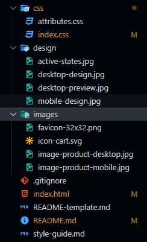

# Frontend Mentor - Product preview card component

## Description

Aqui hise el reto de [**Product Preview Card Main**](https://www.frontendmentor.io/challenges/product-preview-card-component-GO7UmttRfa/hub) terminado en **2 horas (**4:00 pm a 6:00**)**

## **Commit 1** ( **Archivos Hechos** )


Los Archivos que termine subiendo a github

## **Commit 2** ( **HTML Terminado** )

Este es el Codigo HTML final

```html
<main class="card">
    <div class="card__preview">
      
    </div>
    <div class="card__description">
      <h2 class="card__description__desc-title">Perfume</h2>
      <h1 class="card__description__title">Gabrielle Essence Eau De Parfum</h1>
      <p class="card__description__desc">A floral, solar and voluptuous interpretation composed by Olivier Polge, Perfumer-Creator for the House of CHANEL.</p>
      <div class="card__description__cart">
        <p class="card__description__cart__price">$149.99 <span>$169.99</span></p>
        <button class="card__description__cart__cart"> Add to Cart</button>
      </div>
    </div>
</*main>
```

## **Commit 3** ( **CSS Terminado** )

Este es el Codigo CSS final

```css
/* :root (Variables) */
:root {
    /* Fonts */
    --Font-Fraunces: 'Fraunces', serif;
    --Font-Monserrat: 'Montserrat', sans-serif;
    /* Colors */
    /* Primary */
    --Dark-Cyan: hsl(158, 36%, 37%);
    --Cream: hsl(30, 38%, 92%);
    /* Neutral */
    --Very-Dark-Blue: hsl(212, 21%, 14%);
    --Dark-Grayish-Blue: hsl(228, 12%, 48%);
    --White: hsl(0, 0%, 100%);
    --Dark-Grayish-Cyan: hsl(156, 42%, 18%);
}

/* Todos Los Elementos */
* {
    margin: 0px;
    padding: 0px;
    box-sizing: border-box;
}

/* El Cuerpo del Mapa */
body {
    font-size: 14px;
    background-color: var(--Cream);
    font-family: var(--Font-Monserrat);
    color: var(--Very-Dark-Blue);
}

.card {
    background-color: var(--White);
    width: 344px;
    height: 610px;
    overflow: hidden;
    border-radius: 8px;
    margin: 10px auto;
}

.card__preview {
    width: 344px;
    height: 240px;
}

.card__preview__image {
    width: 344px;
    height: 240px;
}

.card__description {
    width: 344px;
    height: 370px;
}

.card__description__desc-title {
    margin: 22px 17px 14px 19px;
    text-transform: uppercase;
    letter-spacing: 5px;
    color: var(--Dark-Grayish-Blue);
    font-size: .91em;
    font-family: var(--Font-Monserrat);
    font-weight: 500;
}

.card__description__title {
    font-family: var(--Font-Fraunces);
    font-size: 2.3em;
    font-weight: 700;
    margin: 0px 17px 14px 19px;
}

.card__description__desc {
    margin: 0px 17px 14px 19px;
    width: 295px;
    height: 80px;
    color: var(--Dark-Grayish-Blue);
    line-height: 24px;
}

.card__description__cart {
    width: 295px;
    height: 98px;
    margin: 28px 17px 14px 19px;
}

.card__description__cart__price {
    color: var(--Dark-Cyan);
    font-family: var(--Font-Fraunces);
    font-size: 2.3em;
    font-weight: 700;
    display: flex;
    flex-direction: row;
    align-content: center;
    justify-content: flex-start;
    align-items: center;
    margin: 0px 17px 14px 0px;
}

.card__description__cart__price span {
    color: var(--Dark-Grayish-Blue);
    font-family: var(--Font-Monserrat);
    font-weight: 500;
    font-size: .40em;
    text-decoration: line-through;
    margin-left: 15px;
}

.card__description__cart__cart {
    display: flex;
    width: 295px;
    height: 48px;
    align-items: center;
    border: none;
    background-color: var(--Dark-Cyan);
    color: var(--White);
    border-radius: 12px;
    align-items: center;
    justify-content: center;
    gap: 7px;
    font-family: var(--Font-Monserrat);
    font-weight: 700;
    transition: all .3s;
}

.card__description__cart__cart:hover {
    background-color: var(--Dark-Grayish-Cyan);
    cursor: pointer;
}
```

## **Commit 4** ( **CSS (Responsive) Terminado** )

```css
@media (min-width: 700px) {
    .card {
        width: 600px;
        height: 450px;
        display: flex;
        justify-content: center;
    }
    .card__preview {
        width: 300px;
        height: 450px;
    }
    .card__preview__image {
        width: 300px;
        height: 450px;
        content: url(../images/image-product-desktop.jpg);
    }
    .card__description {
        width: 300px;
        height: 450px;
    }
    .card__description__title {
        width: 200px;
        height: 90px;
        margin: 0px 17px 40px 19px;
    }
    .card__description__desc {
        width: 226px;
        height: 82px;
        margin-bottom: 35px;
    }
    .card__description__cart__price {
        margin-bottom: 35px;
    }
    .card__description__cart__cart {
        width: 236px;
        height: 48px;
        margin: 0px 10px 0px 10px;
    }
}
```
